  

 

  <b>Vietnam · Hồ Chí Minh</b>

---

## About me

- 🎓 Một số project ở đây nhìn “hơi ngố” vì làm lúc mới vào đại học — mình sẽ dọn và cập nhật dần.
- 🐍 Thích Python cho tool nhỏ, script, và backend.
- 🌐 Làm thêm HTML / JavaScript cho demo web.
- 🧩 Đang đụng tới **Odoo** (custom module, v.v.).
- 📌 Repo gần đây: [`odoo_time_off_custom`](https://github.com/hminh1231/odoo_time_off_custom), [`web_upgrade_version`](https://github.com/hminh1231/web_upgrade_version).

---

## Tech I use

  

---

## GitHub stats

  
  

  

---

## Contribution snake

<picture>
  <source media="(prefers-color-scheme: dark)" srcset="./dist/github-contribution-grid-snake-dark.svg" />
  
</picture>

---

Thống kê ngôn ngữ chỉ dựa trên repo public.

